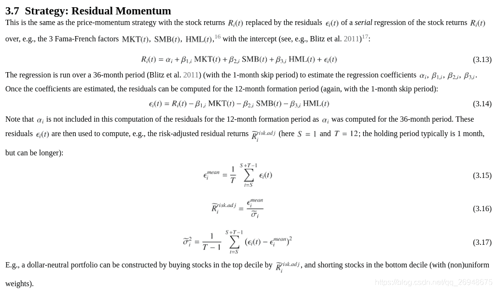
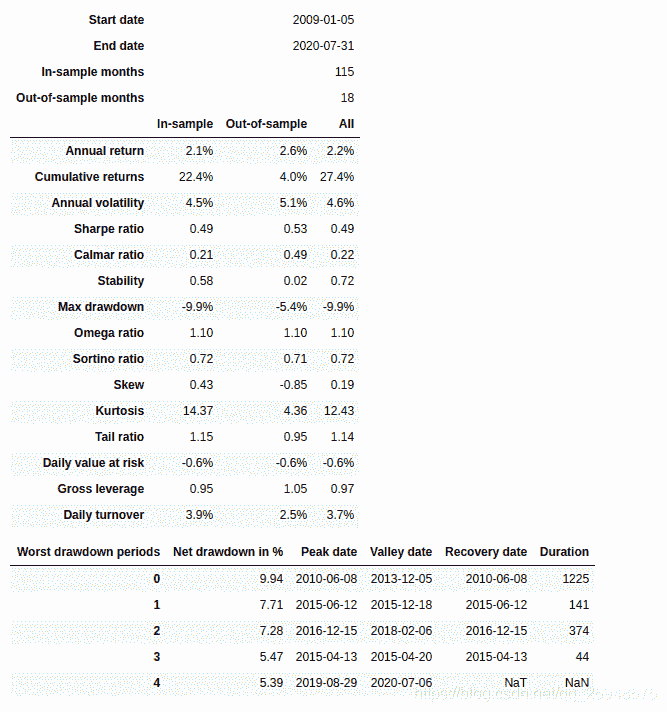
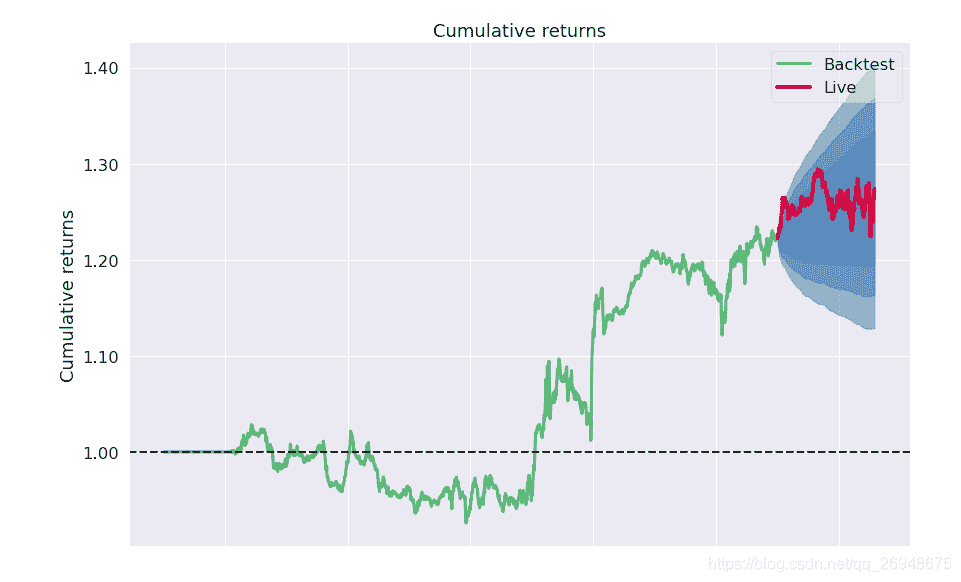
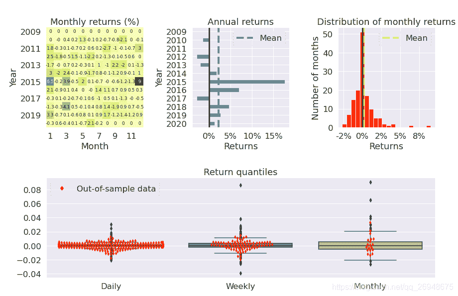

# 57、【backtrader 股票策略】剩余收益率动量策略(residual momentum)【2021-07-04 修改】

> 原文：<https://yunjinqi.blog.csdn.net/article/details/116033734>

[经读者提醒，发现本篇计算剩余收益率的逻辑和原始的策略逻辑有出入，特意修改了两行代码，修改后的结果可以在本文中找到，](https://zhuanlan.zhihu.com/p/367058605)实际上还不如本文原来的策略逻辑呢，感兴趣的可以深入挖掘一下。


这个策略的思路来自于《151 trading strategies》，本文主要分为四个部分：策略逻辑描述、策略代码、策略绩效、策略简单分析

#### 策略逻辑说明

这个策略和价格动量策略类似，只是一个用的价格的一阶差分(收益率)来衡量动量的大小，一个用的是贝塔因子、SMB、HML 这三个因子不能解释的剩余收益率来衡量动量大小，做多动量高的，做空动量低的。

首先，从 csmar 上下载了每个交易日的三个因子的大小，然后使用过去一年的价格数据来计算收益率，用收益率代表 y,三个因子代表 x，进行回归，然后计算模型的残差，并计算风险调整后的剩余收益率，对所有股票的风险调整后的剩余收益率进行排序，做空低的 10%的股票，做多高的 10%的股票

其次，资金分配上，每支股票分配的金额是等额的(实际分配后比较接近，会有误差)

其他策略的设置和原先一样：我们使用全市场的 A 股日数据进行测试，做多头，也做空头。多头和空头都占用资金。假设初始资金有 1 个亿，手续费为万分之二。

#### 策略代码

```py
import backtrader as bt
import statsmodels.api as sm
import datetime
import pandas as pd
import numpy as np
import os,sys
import copy
import talib
import math 
import warnings
warnings.filterwarnings("ignore")
import pyfolio as pf

# 我们使用的时候，直接用我们新的类读取数据就可以了。
class test_two_ma_strategy(bt.Strategy):

    params = (('period',30),
              ('hold_percent',0.1)
             )

    def log(self, txt, dt=None):
        ''' Logging function fot this strategy'''
        dt = dt or self.datas[0].datetime.date(0)
        print('{}, {}'.format(dt.isoformat(), txt))

    def __init__(self):
        # Keep a reference to the "close" line in the data[0] dataseries
        self.bar_num=0    
        # 保存现有持仓的股票
        self.position_dict={}
        # 当前有交易的股票
        self.stock_dict={}
        # 加载法玛三因子数据
        df = pd.read_csv("/home/yun/data/股票三因子数据.csv")
        df = df[df['MarkettypeID']=="P9709"]
        df.index=pd.to_datetime(df['TradingDate'])
        df = df[['RiskPremium1','SMB1','HML1']]
        self.df = df 

    def prenext(self):

        self.next()

    def next(self):
        # 假设有 100 万资金，每次成份股调整，每个股票使用 1 万元
        self.bar_num+=1
        # 前一交易日和当前的交易日
        pre_date = self.datas[0].datetime.date(-1).strftime("%Y-%m-%d")
        current_date = self.datas[0].datetime.date(0).strftime("%Y-%m-%d")
        # 总的价值
        total_value = self.broker.get_value()
        total_cash  = self.broker.get_cash()
        self.log(f"total_value : {total_value}")
        # 第一个数据是指数，校正时间使用，不能用于交易
        # 循环所有的股票,计算股票的数目
        for data in self.datas[1:]:
            # 上市不满一年的股票，忽略不计
            if len(data)>=252:
                data_date = data.datetime.date(0).strftime("%Y-%m-%d")
                # 如果两个日期相等，说明股票在交易
                if current_date == data_date:
                    stock_name = data._name
                    if stock_name not in self.stock_dict:
                        self.stock_dict[stock_name]=1
        # 如果入选的股票小于 100 支，不使用策略
        if len(self.stock_dict)<100:
            return 
        total_target_stock_num = len(self.stock_dict)
        # 现在持仓的股票数目
        total_holding_stock_num = len(self.position_dict)
        # 计算理论上的手数
        now_value = total_value/int(total_target_stock_num*self.p.hold_percent*2)
        # 如果今天是调仓日
        if self.bar_num%self.p.period == 0:

            # 循环股票，平掉所有的股票，计算现在可以交易的股票的累计收益率
            result = []
            for stock_name in self.stock_dict:
                data = self.getdatabyname(stock_name)
                data_date = data.datetime.date(0).strftime("%Y-%m-%d")
                size = self.getposition(data).size
                # 如果有仓位
                if size!=0:
                    self.close(data)
                    if data._name in self.position_dict:
                        self.position_dict.pop(data._name)

                # 已经下单，但是订单没有成交
                if data._name in self.position_dict and size==0:
                    order = self.position_dict[data._name]
                    self.cancel(order)
                    self.position_dict.pop(data._name) 
                # 如果两个日期相等，说明股票在交易,就计算收益率，进行排序
                if current_date == data_date:
                    # 计算股票的收益率,与三因子进行多元回归
                    date_close_list=[]
                    for i in range(252,0,-1):
                        date=data.datetime.date(-i).strftime("%Y-%m-%d")
                        close = data.close[-i]
                        date_close_list.append([date,close])
                    date_close_df = pd.DataFrame(date_close_list,columns=['date','close'])
                    date_close_df['rate']=(date_close_df['close']-date_close_df['close'].shift(1))/date_close_df['close'].shift(1)
                    date_close_df.index = pd.to_datetime(date_close_df['date'])
                    date_close_df = date_close_df.dropna()
                    date_close_df = date_close_df[['rate']]
                    # 把目标收益率的数据框和三因子进行合并
                    df = self.df
                    df = df[df.index<=pd.to_datetime(data_date)]
                    df = pd.concat([date_close_df,df],axis=1, join="inner")
                    # 进行多元回归
                    Y = df['rate']
                    X = df[['RiskPremium1','SMB1','HML1']]
                    X = sm.add_constant(X) # adding a constant
                    model = sm.OLS(Y, X).fit()
                    resid = model.resid
                    # 计算经过风险调整后的残差收益率
                    mean = np.mean(resid)
                    std = np.std(resid)
                    r_a = mean/std
                    result.append([data,r_a])
            # 根据计算出来的累计收益率进行排序，选出前 10%的股票做多，后 10%的股票做空
            new_result = sorted(result,key=lambda x:x[1])
            num = int(self.p.hold_percent * total_target_stock_num)
            sell_list = new_result[:num]
            buy_list = new_result[-num:]
            # 根据计算出来的信号，买卖相应的股票
            for data,cumsum_rate in buy_list:
                lots = now_value/data.close[0]
                lots = int(lots/100)*100 # 计算能下的手数，取整数
                order = self.buy(data,size = lots)
                self.position_dict[data._name] = order
            for data,cumsum_rate in sell_list:
                lots = now_value/data.close[0]
                lots = int(lots/100)*100 # 计算能下的手数，取整数
                order = self.sell(data,size = lots)
                self.position_dict[data._name] = order

    def notify_order(self, order):

        if order.status in [order.Submitted, order.Accepted]:
            return

        if order.status == order.Rejected:
            self.log(f"Rejected : order_ref:{order.ref} data_name:{order.p.data._name}")

        if order.status == order.Margin:
            self.log(f"Margin : order_ref:{order.ref} data_name:{order.p.data._name}")

        if order.status == order.Cancelled:
            self.log(f"Concelled : order_ref:{order.ref} data_name:{order.p.data._name}")

        if order.status == order.Partial:
            self.log(f"Partial : order_ref:{order.ref} data_name:{order.p.data._name}")

        if order.status == order.Completed:
            if order.isbuy():
                self.log(f" BUY : data_name:{order.p.data._name} price : {order.executed.price} , cost : {order.executed.value} , commission : {order.executed.comm}")

            else:  # Sell
                self.log(f" SELL : data_name:{order.p.data._name} price : {order.executed.price} , cost : {order.executed.value} , commission : {order.executed.comm}")

    def notify_trade(self, trade):
        # 一个 trade 结束的时候输出信息
        if trade.isclosed:
            self.log('closed symbol is : {} , total_profit : {} , net_profit : {}' .format(
                            trade.getdataname(),trade.pnl, trade.pnlcomm))
            # self.trade_list.append([self.datas[0].datetime.date(0),trade.getdataname(),trade.pnl,trade.pnlcomm])

        if trade.isopen:
            self.log('open symbol is : {} , price : {} ' .format(
                            trade.getdataname(),trade.price))
    def stop(self):

        pass 

# 初始化 cerebro,获得一个实例
cerebro = bt.Cerebro()
# cerebro.broker = bt.brokers.BackBroker(shortcash=True)  # 0.5%
data_root = "/home/yun/data/stock/day/"
file_list =sorted(os.listdir(data_root))
params=dict(

    fromdate = datetime.datetime(2009,1,4),
    todate = datetime.datetime(2020,7,31),
    timeframe = bt.TimeFrame.Days,
    dtformat = ("%Y-%m-%d"),
    # compression = 1,
    datetime = 0,
    open = 1,
    high = 2,
    low =3,
    close =4,
    volume =5,
    openinterest=-1)

# 加载指数数据
df = pd.read_csv("/home/yun/data/stock/index.csv")
df.columns = ['datetime','open','high','low','close','volume','openinterest']
df.index = pd.to_datetime(df['datetime'])
df = df[['open','high','low','close','volume','openinterest']]
df = df[(df.index<=params['todate'])&(df.index>=params['fromdate'])]
# feed = bt.feeds.GenericCSVData(dataname = "/home/yun/data/stock/index.csv",**params)
feed = bt.feeds.PandasDirectData(dataname = df)
# 添加数据到 cerebro
cerebro.adddata(feed, name = 'index')

# 读取数据
for file in file_list:
    df = pd.read_csv(data_root+file)
    df.columns = ['datetime','open','high','low','close','volume','openinterest']
    df.index = pd.to_datetime(df['datetime'])
    df = df[['open','high','low','close','volume','openinterest']]
    df = df[(df.index<=params['todate'])&(df.index>=params['fromdate'])]
    if len(df)==0:
        continue 
    # feed = bt.feeds.GenericCSVData(dataname = data_root+file,**params)
    feed = bt.feeds.PandasDirectData(dataname = df)
    # 添加数据到 cerebro
    cerebro.adddata(feed, name = file[:-4])
print("加载数据完毕")
# 添加手续费，按照万分之二收取
cerebro.broker.setcommission(commission=0.0002,stocklike=True)
# 设置初始资金为 1 亿
cerebro.broker.setcash(1_0000_0000)
# 添加策略
cerebro.addstrategy(test_two_ma_strategy)
cerebro.addanalyzer(bt.analyzers.TotalValue, _name='_TotalValue')
cerebro.addanalyzer(bt.analyzers.PyFolio)
# 运行回测
results = cerebro.run()
# 打印相关信息
pyfoliozer = results[0].analyzers.getbyname('pyfolio')
returns, positions, transactions, gross_lev = pyfoliozer.get_pf_items()
pf.create_full_tear_sheet(
    returns,
    positions=positions,
    transactions=transactions,
    # gross_lev=gross_lev,
    live_start_date='2019-01-01',
    ) 
```

#### 策略绩效




#### 策略简单分析

从策略带来的收益率上来看，策略在 14 年之后开始表现比较好，在 09 年到 13 年，表现都比较差；另外，总体上的收益率比较低，还不如购买理财产品呢；夏普率也比较低，都不到 0.5；这个策略总体上不太好，需要进一步完善。

可以尝试用一下五因子看下策略的效果怎么样；或者单独使用一个因子，看下会不会效果比较好。

#### 策略使用的数据

1.  股票后复权等数据

链接: https://pan.baidu.com/s/1dGngnBApUMHvUYJ4qM2GZA 提取码: m4ck 复制这段内容后打开百度网盘手机 App，操作更方便哦

2.  三因子数据

链接: https://pan.baidu.com/s/1NkEwDK5rrRiSXpmEogX5Aw 提取码: mcf9 复制这段内容后打开百度网盘手机 App，操作更方便哦

* * *

智慧、心灵、财富，总要有一个在路上，愿我们能在人生的道路上，不断成长、不断成熟～～～

感兴趣可以关注我的专栏：

[my_quant_study_note](https://www.zhihu.com/column/quant-study)：分享一些关于量化投资、量化交易相关的思考

[backtrader 量化投资回测与交易](https://zhuanlan.zhihu.com/c_1189276087837011968)：本专栏免费，分享 backtrader 相关的内容。

[量化投资神器-backtrader 源码解析-从入门到精通：本专栏目前收费 99 元，预计更新 100 篇策略+20 篇 backtrader 讲解+80 篇源代码分析。](https://link.zhihu.com/?target=https%3A//yunjinqi.blog.csdn.net/article/details/107594251)