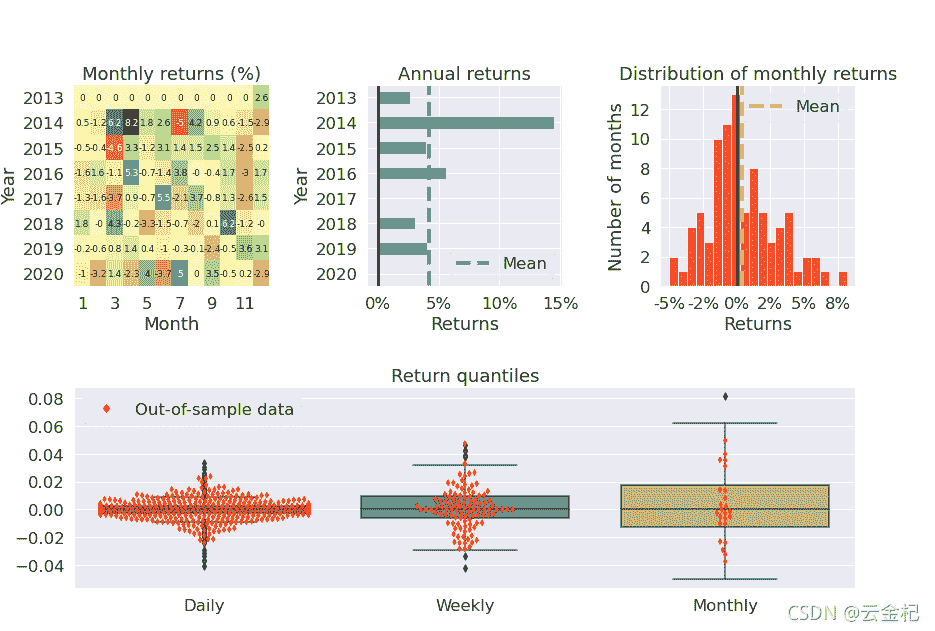
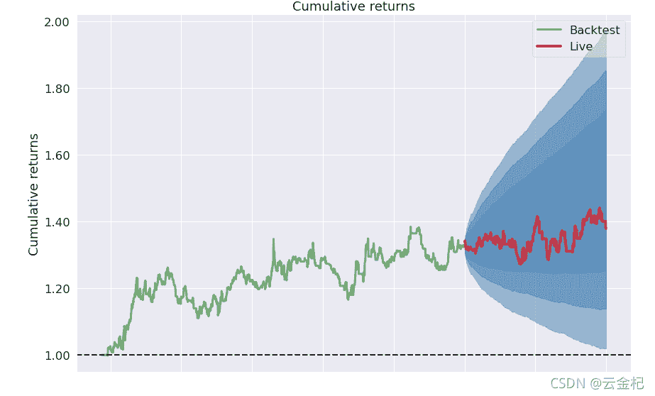
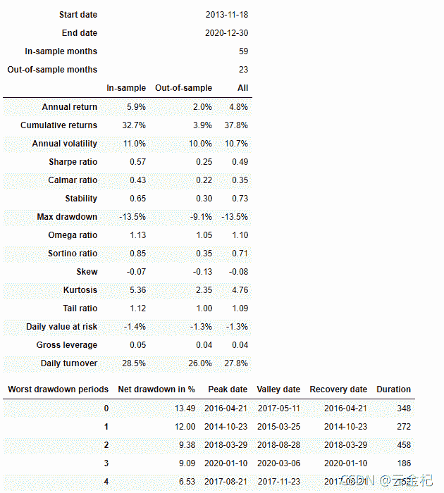

# 65、【backtrader 期货策略】在鸡蛋期货上应用肯特纳通道策略(2021-09-19 更新)

> 原文：<https://yunjinqi.blog.csdn.net/article/details/120386204>

上一篇的基于 macd 与 ema 是实现期货交易策略的模版，并不代表这个策略是有效的。本文将实现一个比较常见的趋势跟踪策略，基于肯特纳通道的突破策略，这个并非是从《151 strategies》中来的，从下个策略开始，我们开始回到这本书上的 151 个策略的实现上。

#### 策略逻辑

指标构建：计算最高价、最低价和收盘价的平均价，然后用平均价的 avg_period 作为中间线，计算 avg_period 个周期的 atr，然后使用 atr_multi*atr 作为带宽，构建上下通道。

做多：无持仓时，当价格向上突破上轨，中间线是向上的，做多；
平多: 有多头仓位时，价格跌破中间线，平多；
做空：无持仓时，当价格向下突破下轨，中间线是向下的，做空；
平空: 当价格在 10 周期的 ema 上方的时候，平空。

交易手数：每次交易 1 手。
初始资金： 5 万元
交易费用： 万分之二。
运行周期： 30 分钟
运行方式：运行在 30 分钟指数合约上，在当时的主力合约上进行交易

#### 策略代码

```py
from __future__ import (absolute_import, division, print_function,
                        unicode_literals)
import time,datetime
import os,sys
import pickle 
# import talib
import numpy as np
import pandas as pd
import random
import statsmodels.api as sm
from sklearn import linear_model

import backtrader as bt  # backtrader
from backtrader.comminfo import ComminfoFuturesPercent,ComminfoFuturesFixed # 期货交易的手续费用，按照比例或者按照金额

# from backtrader.plot.plot import run_cerebro_and_plot  # 个人编写，非 backtrader 自带
import pyfolio as pf

# 编写一个新的 macd 的指标，使得和国内的常用 macd 指标接轨

### 编写相应的策略,每个策略逻辑需要单独编写，回测和实盘直接运行策略类就行

class KeltnerStrategy(bt.Strategy):
    # 策略作者
    author = 'yunjinqi'
    # 策略的参数
    params = (  ("avg_period",110),                  
                ("atr_multi",3),                           
            )
    # log 相应的信息
    def log(self, txt, dt=None):
        ''' Logging function fot this strategy'''
        dt = dt or bt.num2date(self.datas[0].datetime[0])
        print('{}, {}'.format(dt.isoformat(), txt))

    # 初始化策略的数据
    def __init__(self):
        # 基本上常用的部分属性变量
        self.bar_num = 0                 # next 运行了多少个 bar
        self.current_date = None        # 当前交易日
        # 计算 macd 指标
        self.middle_price = (self.datas[0].high+ self.datas[0].low+ self.datas[0].close)/3
        self.middle_line = bt.indicators.SMA(self.middle_price, period = self.p.avg_period)
        self.atr = bt.indicators.AverageTrueRange(self.datas[0],period = self.p.avg_period )
        self.upper_line = self.middle_line+self.atr*self.p.atr_multi
        self.lower_line = self.middle_line-self.atr*self.p.atr_multi
        # 保存现在持仓的合约是哪一个
        self.holding_contract_name = None

    def prenext(self):
        # 由于期货数据有几千个，每个期货交易日期不同，并不会自然进入 next
        # 需要在每个 prenext 中调用 next 函数进行运行
        self.next() 
        # pass 

    # 在 next 中添加相应的策略逻辑
    def next(self):
        # 每次运行一次，bar_num 自然加 1,并更新交易日
        self.current_date = bt.num2date(self.datas[0].datetime[0])
        self.bar_num+=1
        # self.log(f"{self.bar_num},{self.datas[0]._name},{self.broker.getvalue()}")
        # self.log(f"{self.ema_1[0]},{self.ema_2[0]},{self.dif[0]},{self.dea[0]},{self.macd[0]}")
        data = self.datas[0]
        # 开仓，先平后开
        # 平多
        if self.holding_contract_name is not None and self.getpositionbyname(self.holding_contract_name).size>0 and data.close[0]<self.middle_line[0]:
            data = self.getdatabyname(self.holding_contract_name)
            self.close(data)
            self.holding_contract_name = None
        # 平空
        if self.holding_contract_name is not None  and self.getpositionbyname(self.holding_contract_name).size<0 and data.close[0]>self.middle_line[0]:
            data = self.getdatabyname(self.holding_contract_name)
            self.close(data)
            self.holding_contract_name = None

        # 开多
        if self.holding_contract_name is None and data.close[-1]<self.upper_line[-1] and data.close[0]>self.upper_line[0] and self.middle_line[0]>self.middle_line[-1]:
            dominant_contract = self.get_dominant_contract()
            next_data = self.getdatabyname(dominant_contract)
            self.buy(next_data,size=1)
            self.holding_contract_name = dominant_contract

        # 开空
        if self.holding_contract_name is None and data.close[-1]>self.lower_line[-1] and data.close[0]<self.lower_line[0] and self.middle_line[0]<self.middle_line[-1]:
            dominant_contract = self.get_dominant_contract()
            next_data = self.getdatabyname(dominant_contract)
            self.sell(next_data,size=1)
            self.holding_contract_name = dominant_contract

        # 移仓换月
        if self.holding_contract_name is not None:
            dominant_contract = self.get_dominant_contract()
            # 如果出现了新的主力合约，那么就开始换月
            if dominant_contract!=self.holding_contract_name:
                # 下个主力合约
                next_data = self.getdatabyname(dominant_contract)
                # 当前合约持仓大小及数据
                size = self.getpositionbyname(self.holding_contract_name).size # 持仓大小
                data = self.getdatabyname(self.holding_contract_name)
                # 平掉旧的
                self.close(data)
                # 开新的
                if size>0:
                    self.buy(next_data,size=abs(size))
                if size<0:
                    self.sell(next_data,size=abs(size))
                self.holding_contract_name = dominant_contract

    def get_dominant_contract(self):

        # 以持仓量最大的合约作为主力合约,返回数据的名称
        # 可以根据需要，自己定义主力合约怎么计算

        # 获取当前在交易的品种
        target_datas=[]
        for data in self.datas[1:]: 
            try:
                data_date = bt.num2date(data.datetime[0])
                # self.log(f"{data._name},{data_date}")
                if self.current_date==data_date:
                    target_datas.append([data._name,data.openinterest[0]])
            except:
                self.log(f"{data._name}还未上市交易")

        target_datas = sorted(target_datas,key = lambda x:x[1])
        # print(target_datas)
        return target_datas[-1][0]

    def notify_order(self, order):

        if order.status in [order.Submitted, order.Accepted]:
            return

        if order.status == order.Rejected:
            self.log(f"Rejected : order_ref:{order.ref} data_name:{order.p.data._name}")

        if order.status == order.Margin:
            self.log(f"Margin : order_ref:{order.ref} data_name:{order.p.data._name}")

        if order.status == order.Cancelled:
            self.log(f"Concelled : order_ref:{order.ref} data_name:{order.p.data._name}")

        if order.status == order.Partial:
            self.log(f"Partial : order_ref:{order.ref} data_name:{order.p.data._name}")

        if order.status == order.Completed:
            if order.isbuy():
                self.log(f" BUY : data_name:{order.p.data._name} price : {order.executed.price} , cost : {order.executed.value} , commission : {order.executed.comm}")

            else:  # Sell
                self.log(f" SELL : data_name:{order.p.data._name} price : {order.executed.price} , cost : {order.executed.value} , commission : {order.executed.comm}")

    def notify_trade(self, trade):
        # 一个 trade 结束的时候输出信息
        if trade.isclosed:
            self.log('closed symbol is : {} , total_profit : {} , net_profit : {}' .format(
                            trade.getdataname(),trade.pnl, trade.pnlcomm))
            # self.trade_list.append([self.datas[0].datetime.date(0),trade.getdataname(),trade.pnl,trade.pnlcomm])

        if trade.isopen:
            self.log('open symbol is : {} , price : {} ' .format(
                            trade.getdataname(),trade.price))

    def stop(self):
        # 策略停止的时候输出信息
        # with open("C:/data/filter_data_contract.pkl",'wb') as f:
        #    pickle.dump(self.my_datases,f)
        # df = pd.DataFrame(self.trade_result)
        # df.columns=['datetime','symbol','size','current_price','order_price','pnl','net_profit']
        # df.to_csv("C:/result/test1_trade_history.csv")

        # df1 = pd.DataFrame(self.position_result)
        # df1.columns=['datetime','symbol','size','close']
        # df1.to_csv("c:/result/test1_position_history.csv")

        # df2=pd.DataFrame(self.order_result)
        # df2.columns=["datetime",'symbol','size','0','direction']
        # df2.to_csv("C:/result/test1_order_history.csv")
        pass 

# 准备配置策略
cerebro = bt.Cerebro()
# 参数设置
data_kwargs = dict(
            fromdate = datetime.datetime(2013,11, 18),
            todate = datetime.datetime(2020,12,31),
            timeframe = bt.TimeFrame.Minutes,
            compression = 1,
            dtformat=('%Y-%m-%d %H:%M:%S'), # 日期和时间格式
            tmformat=('%H:%M:%S'), # 时间格式
            datetime=0,
            high=3,
            low=4,
            open=1,
            close=2,
            volume=5,
            openinterest=6)

data_root = "c:/data/future/15m/jd/"
# 加载具体的合约数据
file_list =os.listdir(data_root)
file_list.remove("JD99.csv")
# 确保传入的第一个数据是指数数据
for file in ["JD99.csv"]+file_list:
    name = file[:-4]
    df = pd.read_csv(data_root+file)
    # 只要数据里面的这几列
    df = df[['datetime','open','high','low','close','volume','openinterest']]
    # 修改列的名字
    df.index = pd.to_datetime(df['datetime'])
    # 如果对数据的时间顺序比较确定是从小到大的，可以不用排序，否则最好做下排序
    df = df[['open','high','low','close','volume','openinterest']]
    df = df[(df.index<=data_kwargs['todate'])&(df.index>=data_kwargs['fromdate'])]
    # feed = bt.feeds.GenericCSVData(dataname = data_root+file,**params)
    # print(name,len(df))
    if len(df)==0:
        continue 
    feed = bt.feeds.PandasDirectData(dataname = df)
    cerebro.adddata(feed, name = name)
    # 设置合约的交易信息，佣金设置为 2%%，保证金率为 10%(交易所加期货公司部分，每个人可能不一样)，杠杆按照真实的杠杆来
    comm=ComminfoFuturesPercent(commission=0.0002,margin=0.1, mult=10)
    cerebro.broker.addcommissioninfo(comm, name= name)
cerebro.broker.setcash(50000.0)
# 添加策略
cerebro.addstrategy(KeltnerStrategy)
cerebro.addanalyzer(bt.analyzers.TotalValue, _name='_TotalValue')
cerebro.addanalyzer(bt.analyzers.PyFolio)

# 运行回测
results = cerebro.run()

pyfoliozer = results[0].analyzers.getbyname('pyfolio')
returns, positions, transactions, gross_lev = pyfoliozer.get_pf_items()
pf.create_full_tear_sheet(
    returns,
    positions=positions,
    transactions=transactions,
    # gross_lev=gross_lev,
    live_start_date='2019-01-01',
    ) 
```

#### 回测结果





#### 策略点评

典型的趋势跟踪策略里面的突破策略，与布林带通道突破，四周突破等本质上都是类似的，都是企图抓住未来的大的趋势。这个 策略虽然简单，但是策略很有逻辑性，可以考虑进一步改进优化。

#### 测试数据

链接: https://pan.baidu.com/s/1PI9nenWu79tqRyjGI68Oaw 提取码: rh5j 复制这段内容后打开百度网盘手机 App，操作更方便哦