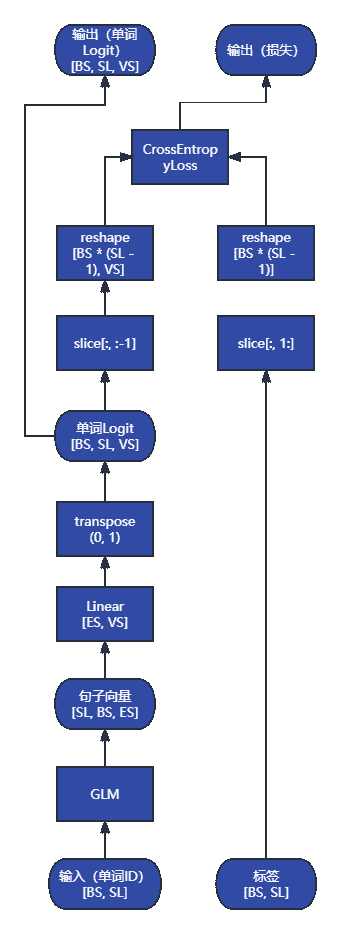

<!--yml
category: 未分类
date: 2023-10-10 23:18:30
-->

# ChatGLM2 源码解析：`ChatGLMForConditionalGeneration.forward`-CSDN博客

> 来源：[https://blog.csdn.net/wizardforcel/article/details/132675102](https://blog.csdn.net/wizardforcel/article/details/132675102)



```
class ChatGLMForConditionalGeneration(ChatGLMPreTrainedModel):
    def __init__(self, config: ChatGLMConfig, empty_init=True, device=None):
        super().__init__(config)

        self.max_sequence_length = config.max_length
        self.transformer = ChatGLMModel(config, empty_init=empty_init, device=device)
        self.config = config
        self.quantized = False

        if self.config.quantization_bit:
            self.quantize(self.config.quantization_bit, empty_init=True)

    def forward(
            self,
            input_ids: Optional[torch.Tensor] = None,
            position_ids: Optional[torch.Tensor] = None,
            attention_mask: Optional[torch.Tensor] = None,
            past_key_values: Optional[Tuple[torch.FloatTensor]] = None,
            inputs_embeds: Optional[torch.Tensor] = None,
            labels: Optional[torch.Tensor] = None,
            use_cache: Optional[bool] = None,
            output_attentions: Optional[bool] = None,
            output_hidden_states: Optional[bool] = None,
            return_dict: Optional[bool] = None,
            return_last_logit: Optional[bool] = False,
    ):
        use_cache = use_cache if use_cache is not None else self.config.use_cache
        return_dict = return_dict if return_dict is not None else self.config.use_return_dict

        transformer_outputs = self.transformer(
            input_ids=input_ids,
            position_ids=position_ids,
            attention_mask=attention_mask,
            past_key_values=past_key_values,
            inputs_embeds=inputs_embeds,
            use_cache=use_cache,
            output_hidden_states=output_hidden_states,
            return_dict=return_dict,
        )

        hidden_states = transformer_outputs[0]

        if return_last_logit:
            hidden_states = hidden_states[-1:]

        lm_logits = self.transformer.output_layer(hidden_states)

        lm_logits = lm_logits.transpose(0, 1).contiguous()

        loss = None
        if labels is not None:
            lm_logits = lm_logits.to(torch.float32)

            shift_logits = lm_logits[..., :-1, :].contiguous()
            shift_labels = labels[..., 1:].contiguous()

            loss_fct = CrossEntropyLoss(ignore_index=-100)
            loss = loss_fct(shift_logits.view(-1, shift_logits.size(-1)), shift_labels.view(-1))

            lm_logits = lm_logits.to(hidden_states.dtype)
            loss = loss.to(hidden_states.dtype)

        if not return_dict:
            output = (lm_logits,) + transformer_outputs[1:]
            return ((loss,) + output) if loss is not None else output

        return CausalLMOutputWithPast(
            loss=loss,
            logits=lm_logits,
            past_key_values=transformer_outputs.past_key_values,
            hidden_states=transformer_outputs.hidden_states,
            attentions=transformer_outputs.attentions,
        ) 
```