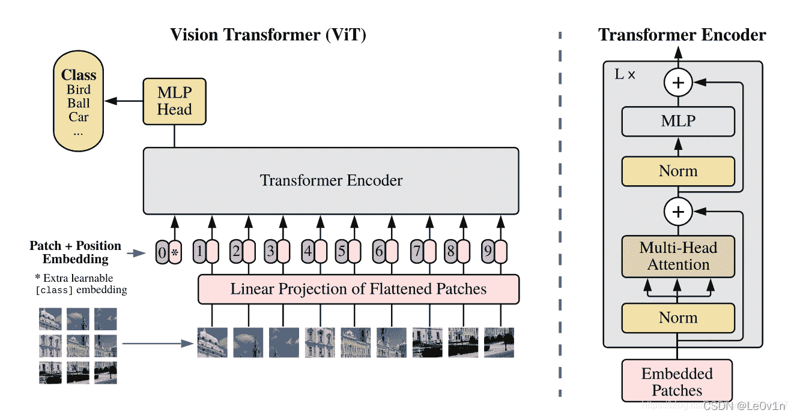

<!--yml
category: 未分类
date: 2023-10-10 23:17:09
-->

# VisionTransformer（ViT）详细架构图-CSDN博客

> 来源：[https://blog.csdn.net/wizardforcel/article/details/133438092](https://blog.csdn.net/wizardforcel/article/details/133438092)

这是原版的架构图，少了很多东西。

这是我根据源码总结出来的详细版

有几点需要说明的，看架构图能看懂就不用看注释了。

（1）输入图片必须是 224x224x3 的，如果不是就把它缩放到这个尺寸。

（2）Tranformer要的是嵌入向量的序列，大概是`SeqLen, HidSize`形状的二维数组，然后图像是`H, W, C`的三维数组，想把它塞进去必须经过一步转换，这是嵌入模块做的事情。

简单来讲就是切成大小为`16*16*3`的片段（Patch）然后每个片段都经过一步线性映射转换为长度`768`的一维向量。这一步在代码中通过一个`Conv2d`来一次性完成。

我们的这个卷积层，包含768 个大小为`16*16*3`的卷积核，步长等于卷积核大小。也就是说，它相当于把图像切成`16*16*3`的片段，然后每个片段和每个卷积核相乘并求和得到一个值。每个片段一共产生768个值，顺序排列得到一个一维向量，就是它的嵌入向量，然后所有片段的嵌入向量再顺序排列，得到整个图片的嵌入序列，就是这样。

（3）之后会在序列开头添加一个特殊的嵌入向量，是`<CLS>`，这个嵌入向量没有其它意义，只代表输出的这个位置的嵌入，应该计算为整个图像的类别嵌入。

（4）之后会添加位置嵌入，不是编码，因为它是可以学习的，也就是不锁定梯度。很多 Tranformer 都是位置嵌入，因为它是锁梯度的。

（5）位置嵌入之后会有个Dropout层，在论文原图中没有，似乎很多Bert或者GPT变体都会有这个东西。

（6）之后经过 12 个 TF 块，这个块和 Bert 是一样的，没有啥魔改。

（7）TF块之后会有个LayerNorm，原图里没有，这个也是很多变体里面出现过的。

（8）因为我们要分类，或者说论文中采用分类任务，需要取类别嵌入，也就是`SeqLen`维度的第一个元素。

（9）之后经过一个线性+Tanh，论文里面说只有预训练时期需要这个，迁移的时候可以直接扔掉。

（10）之后是线性+Softmax，用于把类别嵌入转化成图像属于各类的概率。