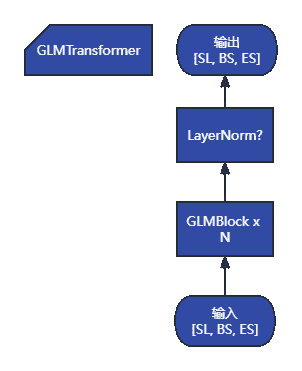

<!--yml
category: 未分类
date: 2023-10-10 23:18:11
-->

# ChatGLM2 源码解析：`GLMTransformer`-CSDN博客

> 来源：[https://blog.csdn.net/wizardforcel/article/details/132686803](https://blog.csdn.net/wizardforcel/article/details/132686803)



```py
 class GLMTransformer(torch.nn.Module):
    """Transformer class."""

    def __init__(self, config: ChatGLMConfig, device=None):
        super(GLMTransformer, self).__init__()

        self.fp32_residual_connection = config.fp32_residual_connection
        self.post_layer_norm = config.post_layer_norm

        # LayerCount
        self.num_layers = config.num_layers

        # TFBlock 层
        def build_layer(layer_number):
            return GLMBlock(config, layer_number, device=device)

        self.layers = torch.nn.ModuleList([build_layer(i + 1) for i in range(self.num_layers)])

        # 如果最后添加 LN，初始化 LN 层
        if self.post_layer_norm:
            LayerNormFunc = RMSNorm if config.rmsnorm else LayerNorm
            # Final layer norm before output.
            self.final_layernorm = LayerNormFunc(config.hidden_size, eps=config.layernorm_epsilon, device=device,
                                                 dtype=config.torch_dtype)

        self.gradient_checkpointing = False

    def _get_layer(self, layer_number):
        return self.layers[layer_number]

    def forward(
            self, hidden_states, attention_mask, rotary_pos_emb, kv_caches=None,
            use_cache: Optional[bool] = True,
            output_hidden_states: Optional[bool] = False,
    ):
        # 如果没有提供 KV 缓存，将其初始化为 [None] * LayerCount 保持代码统一
        if not kv_caches:
            kv_caches = [None for _ in range(self.num_layers)]
        # `presents`保存每一层的 KV 的缓存
        presents = () if use_cache else None
        if self.gradient_checkpointing and self.training:
            if use_cache:
                logger.warning_once(
                    "`use_cache=True` is incompatible with gradient checkpointing. Setting `use_cache=False`..."
                )
                use_cache = False

        all_self_attentions = None
        # `all_hidden_states`保存输入和所有层的输出
        all_hidden_states = () if output_hidden_states else None
        
        # 输入 -> TFBlock1 -> TFBlock2 -> ... TFBLockN -> LN? -> 输出
        for index in range(self.num_layers):
            # 将当前一层的输入存入`all_hidden_states`
            if output_hidden_states:
                all_hidden_states = all_hidden_states + (hidden_states,)

            # 获取当前一层，将输入扔进去，得到输出和 KV 缓存
            layer = self._get_layer(index)
            if self.gradient_checkpointing and self.training:
                layer_ret = torch.utils.checkpoint.checkpoint(
                    layer,
                    hidden_states,
                    attention_mask,
                    rotary_pos_emb,
                    kv_caches[index],
                    use_cache
                )
            else:
                layer_ret = layer(
                    hidden_states,
                    attention_mask,
                    rotary_pos_emb,
                    kv_cache=kv_caches[index],
                    use_cache=use_cache
                )
            # 将输出作为新的输入
            hidden_states, kv_cache = layer_ret
            # 保存当前一层的 KV 缓存
            if use_cache:
                presents = presents + (kv_cache,)

        # 将最后一层的输出存入`all_hidden_states`
        if output_hidden_states:
            all_hidden_states = all_hidden_states + (hidden_states,)

        # 将最后一层的输出传给 LN 得到 GLM 输出
        if self.post_layer_norm:
            hidden_states = self.final_layernorm(hidden_states)

        # 返回 GLM 输出，所有层的 KV 缓存，所有层的输出，以及所有层的注意力矩阵（None）
        return hidden_states, presents, all_hidden_states, all_self_attentions
```