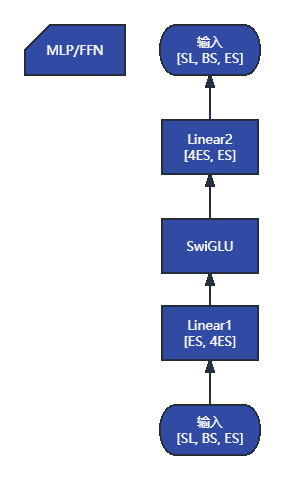

<!--yml
category: 未分类
date: 2023-10-10 23:19:05
-->

# ChatGLM2 源码解析：`MLP`_绝不原创的飞龙的博客-CSDN博客

> 来源：[https://blog.csdn.net/wizardforcel/article/details/132674796](https://blog.csdn.net/wizardforcel/article/details/132674796)



```
class MLP(torch.nn.Module):
    """MLP.

    MLP will take the input with h hidden state, project it to 4*h
    hidden dimension, perform nonlinear transformation, and project the
    state back into h hidden dimension.
    """

    def __init__(self, config: ChatGLMConfig, device=None):
        super(MLP, self).__init__()

        self.add_bias = config.add_bias_linear

        self.dense_h_to_4h = nn.Linear(
            config.hidden_size,
            config.ffn_hidden_size * 2,
            bias=self.add_bias,
            device=device,
            **_config_to_kwargs(config)
        )

        def swiglu(x):
            x = torch.chunk(x, 2, dim=-1)
            return F.silu(x[0]) * x[1]

        self.activation_func = swiglu

        self.dense_4h_to_h = nn.Linear(
            config.ffn_hidden_size,
            config.hidden_size,
            bias=self.add_bias,
            device=device,
            **_config_to_kwargs(config)
        )

    def forward(self, hidden_states):

        intermediate_parallel = self.dense_h_to_4h(hidden_states)
        intermediate_parallel = self.activation_func(intermediate_parallel)
        output = self.dense_4h_to_h(intermediate_parallel)
        return output 
```